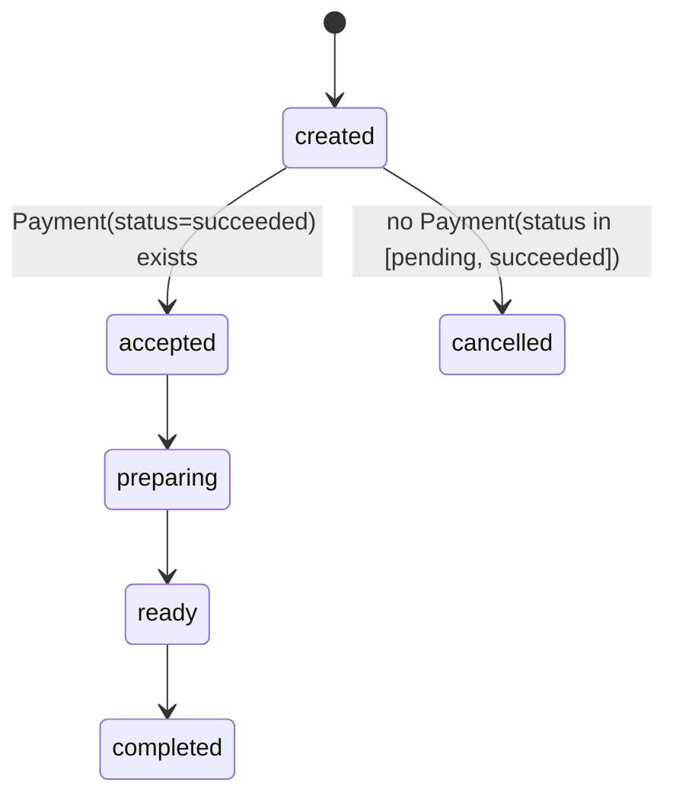
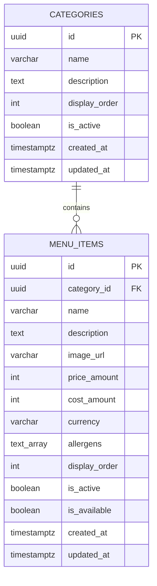
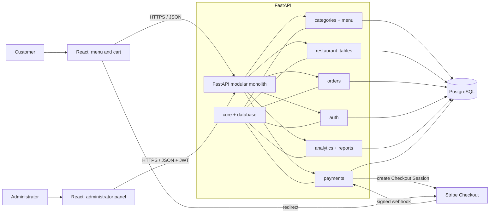

# System Architecture

## 1. Architectural Goals

The architecture must ensure financial data correctness, secure Stripe
integration, clear separation of responsibilities, and ease of demonstration.
The system remains simple enough for one person to develop and explain during a
job interview.

## 2. Selected Stack

### Backend

- Python 3.12 as the target version;
- FastAPI;
- Pydantic 2;
- SQLAlchemy 2;
- Alembic;
- PostgreSQL;
- pytest;
- Ruff, Black, and isort in accordance with repository rules.

### Frontend

- React;
- TypeScript;
- Vite;
- React Router;
- React Context initially; Zustand only if shared state becomes difficult to
  maintain;
- Recharts for dashboard charts.

### Integrations and Infrastructure

- Stripe Checkout and Stripe webhooks in test mode;
- Docker and Docker Compose;
- GitHub Actions;
- planned hosting: Vercel for the frontend, Render for the backend, and Neon for
  PostgreSQL.

Hosting services are planned for the demo version and are not required for the
initial local stages. Their limitations and current terms must be reviewed
before the deployment stage.

## 3. Architecture Style: Modular Monolith

The backend is one application deployed as a single process, but the code is
divided by business capability. Modules communicate within the process and use
a shared PostgreSQL database. Module boundaries prevent accidental mixing of
responsibilities but do not create network boundaries between microservices.

Each module may contain only the elements it needs:

- SQLAlchemy models;
- Pydantic schemas;
- FastAPI routers;
- business logic;
- queries or data-access operations;
- tests.

A separate layer will not be created merely to pass through a single call.
Domain logic remains independent of FastAPI, Stripe, and interface-rendering
details where doing so improves testability.

## 4. Main Backend Modules

| Module | Responsibility |
| --- | --- |
| `core` | configuration, security, shared errors, and cross-cutting concerns |
| `database` | engine, sessions, model base, and migration integration |
| `auth` | administrator sign-in, password hashing, JWT, and current user |
| `categories` | categories and their order in the menu |
| `menu` | menu items, prices, allergens, activity, and availability |
| `restaurant_tables` | tables and dine-in order validation |
| `orders` | quoting, orders, snapshots, public access, `order_status`, and its history |
| `payments` | `Payment` attempts, Stripe sessions, `payment_status`, webhook verification, and idempotency |
| `analytics` | KPI definitions and dashboard aggregations |
| `reports` | filtered CSV exports |

## 5. Flow Between Components

### 5.1. Menu Retrieval

React calls public FastAPI endpoints. The categories and menu modules read
active records from PostgreSQL. Active but unavailable items remain visible by
default, while an optional availability filter hides them. FastAPI returns
explicit public response schemas without administrative data.

### 5.2. Order and Payment

React submits only product identifiers, quantities, and order-type data.
FastAPI validates the data in PostgreSQL, calculates amounts, and stores the
order and snapshots without creating a `Payment` and without communicating with
Stripe. The response contains the `public_order_number` and, once, the raw
`order_access_token`.

A separate Checkout endpoint requires the `public_order_number`, the
`X-Order-Access-Token` header, and the `Idempotency-Key` header. It creates a
`Payment(status=pending)` for the amount stored on `Order`, then creates a
Stripe session. The same order and key pair cannot create another attempt or
session. Stripe communicates the final payment outcome directly to the webhook
endpoint. A verified event is processed idempotently in a transaction.

The Stripe call does not occur inside a database transaction. A short
transaction first locks `Order`, checks `Payment`, and stores the new attempt
and idempotency data. Stripe is called after the transaction commits. The
session identifier or failure outcome is stored in another short transaction,
again following the `Order -> Payment` order.

### 5.3. Administration and Analytics

Protected FastAPI endpoints verify the administrator JWT. The orders,
analytics, and reports modules perform controlled operations on PostgreSQL.
React presents the results but does not define KPI rules or permissions.

### 5.4. Independent Status Lifecycles

Each payment attempt has its own `payment_status`: `pending`, `succeeded`,
`failed`, or `expired`. Transitions are one-way and lead only from `pending` to
one of the terminal states. Retrying payment creates a new attempt record; it
does not change a completed record to `pending`.

The relationship is `Order 1:N Payment`. At most one `pending` attempt and at
most one `succeeded` attempt may exist for an order. A new attempt is allowed
only when neither status exists. PostgreSQL protects the constraints with two
partial unique indexes, while application logic handles conflicts between
concurrent requests. The source of payment confirmation is a related
`Payment(status=succeeded)` record, not an auxiliary value on `Order`.

Order fulfilment uses a separate `order_status`: `created`, `accepted`,
`preparing`, `ready`, `completed`, or `cancelled`. The allowed transition graph
is:



There are no backward transitions. `paid` and `pending_payment` are not part of
`order_status`. An `Order` may transition to `cancelled` only when no `Payment`
has status `pending` or `succeeded`. `failed`, `expired`, and the absence of
attempts do not block cancellation. An active `pending` attempt produces a
domain conflict with the provisional name `active_payment_attempt`; the
customer or administrator waits for the attempt to finish.

Checking `Payment` attempts and writing `order_status = cancelled` must be part
of one transactional operation. The logic reads state from the database and
does not trust status values submitted by the frontend. This prevents a race in
which an active Checkout Session ends with a later success webhook.

After successful payment, the order cannot be cancelled in the MVP; the
`accepted -> cancelled` transition does not exist. `order_status = cancelled`
does not change `payment_status`. The MVP does not automatically expire Stripe
sessions during cancellation and does not cancel an order with an active
session. Every `order_status` change is audited in the history. A future
`refund_status` will be a third, independent lifecycle and will allow later
design of paid-order cancellation.

### 5.5. Concurrency Control for Financial Operations

Order cancellation, creation of a new `Payment`, and Stripe webhook handling
serialize critical changes by locking the relevant `Order` record. Each flow:

1. starts a short transaction;
2. locks `Order`, for example with `SELECT ... FOR UPDATE`;
3. reads or locks related `Payment` records in a stable order;
4. checks invariants and idempotency;
5. stores the change;
6. commits the transaction.

The only allowed lock order is `Order -> Payment`. No flow may lock `Payment`
first and then wait for `Order`. Locking and state retrieval happen on the
backend; the frontend does not provide authoritative payment or order state.

Partial unique indexes for one `pending` and one `succeeded` payment per
`Order` remain a mandatory second line of protection. An index conflict is
handled explicitly and cannot result in a second attempt.

A transaction does not include waiting for Stripe. Checkout uses a stable
idempotency key and at least two short database phases: preparing the attempt
before the call and storing the result after the call. Every phase that changes
`Order` or `Payment` again follows `Order -> Payment` and rechecks the
invariants because state may have changed during the external operation.

### 5.6. Public Order Access

`Order` has a presentational `public_order_number` and a separate
`order_access_token` with at least 256 bits of randomness. The raw token is
returned only when the order is created. The database stores only its SHA-256
hash, and verification compares the calculated hash in constant time.

Public status retrieval requires the number and the `X-Order-Access-Token`
header. An invalid number and an invalid token produce the same generic error.
The response is limited to the public number, `order_status`, a payment summary
without Stripe identifiers, `order_type`, creation and update timestamps, and
an estimated or completed timestamp when one exists.

### 5.7. MVP Analytics

The basic dashboard contains collected revenue, succeeded orders count, average
order value, sales by product, sales by category, and dine-in vs takeaway.
Collected revenue is the sum of `Payment(status=succeeded)` records by
confirmation time. Succeeded orders count counts distinct orders with such a
payment, and average order value is the quotient of these two metrics. Product
and category sales use `OrderItem` snapshots from successfully paid orders.
Dine-in vs takeaway groups their count and collected revenue by `order_type`.

Refunds are outside the MVP, so collected revenue is not automatically reduced
by refunds. Refund-adjusted revenue and other extended KPIs will be added later.
MVP exports cover orders, product sales, and payments.

### 5.8. Menu Data Model



Category and MenuItem identifiers are UUIDs generated by the application.
`cost_amount` is nullable because an unknown cost differs from a known zero
cost. `text_array` in the diagram represents PostgreSQL `TEXT[]`, tracked by
SQLAlchemy `MutableList`. All monetary values use integer minor units.

The relationship uses `ON DELETE RESTRICT`, `passive_deletes="all"`, and no ORM
delete cascade. Names remain stored as provided, while functional indexes apply
`lower(btrim(name))` to enforce case-insensitive and trim-insensitive
uniqueness. `is_active` controls long-term visibility; MenuItem
`is_available` independently represents temporary sellability, so an active
item may remain visible while unavailable.

### 5.9. Local Demonstration Seed

The seed has an immutable, typed data layer containing fixed UUIDs and a
transactional runner that performs normalized-name preflight checks followed by
conditional PostgreSQL primary-key upserts. One transaction contains every
preflight and write. Seed ownership is limited to the approved fixed UUIDs;
unrelated records are never deleted, replaced, or claimed by name.

The explicit `python -m app.seed` CLI is a local-only integration boundary. It
validates the exact development database allowlist before creating an Engine.
Imports have no side effects, and the seed has no application startup,
migration, Docker Compose, CI, deployment, or other automatic hook. Conditional
`IS DISTINCT FROM` updates restore canonical values while preserving
`created_at` and avoiding an `updated_at` change for a no-op rerun.

### 5.10. Implemented Public Menu API

The FastAPI application is created through an injectable app factory. Its
lifespan creates one synchronous SQLAlchemy Engine and session factory for a
normal application run, stores the factory in application state, and disposes
the owned Engine at shutdown. Tests may inject a session factory whose Engine
lifecycle remains owned by the fixtures. Importing the application does not
connect, query, migrate, or seed.

A request dependency creates and closes one synchronous Session without an
automatic commit. The public menu router is mounted at `/api/v1/menu` and uses
five strict Pydantic response schemas. The schemas are populated explicitly;
ORM entities are not serialized, so `cost_amount`, timestamps, internal
activity state, and raw product category identifiers cannot leak into the
contract.

The read-only query layer uses two column-level SELECT statements for a
non-empty menu: one for active categories and one for active items. If no
active category exists, only the category SELECT runs. Item details use one
column-level SELECT with a Category join. This avoids lazy loading and N+1
access while keeping database work independent of FastAPI.

The default list and detail view include active but unavailable items with
`is_available=false`; `available_only=true` removes unavailable items from the
list. Inactive categories, their items, inactive items, and categories without
visible items are omitted. Categories and items are ordered by
`display_order`, then UUID. This read path does not change the Stage 4 ERD.

### 5.11. Implemented Order Quoting

The `orders` package currently contains only the public quote use case:
request and response schemas, a FastAPI-independent quoting layer, and the
`/api/v1/orders/quote` router. It does not contain SQLAlchemy models or order
persistence.

The request accepts only unique menu item identifiers and quantities. The
quoting layer executes one explicit column-level SELECT joining `MenuItem` and
`Category`, then validates item activity, category activity, and availability
in request order. Mixed currency is checked only after all item-level
validation succeeds. The response preserves request order.

All price calculations use Python integers and minor units. Names, unit prices,
and currency come from the database. The quote is a transient point-in-time
snapshot with no identifier, timestamp, expiry, persistence, or reservation.
The operation executes zero writes and does not alter the Stage 4 ERD.

The router maps missing and non-public items to 404, unavailable items to 409,
mixed currencies to a distinct 409 detail, and request validation to the
standard 422 response. Future Stage 8 order creation must ignore previous quote
responses, re-read all authoritative menu state, and create durable snapshots
only when an order is persisted.

## 6. Architecture Diagram



## 7. Planned Backend Structure

The structure is a direction, not an instruction to create every file at once.
Each stage adds only the elements it needs.

```text
backend/
├── alembic/
│   └── versions/
├── app/
│   ├── auth/
│   ├── categories/
│   ├── menu/
│   ├── restaurant_tables/
│   ├── orders/
│   ├── payments/
│   ├── analytics/
│   ├── reports/
│   ├── core/
│   ├── database/
│   └── main.py
├── tests/
│   ├── unit/
│   ├── integration/
│   └── api/
├── alembic.ini
└── pyproject.toml
```

Files such as `models.py`, `schemas.py`, `router.py`, and `service.py` are
allowed within a module, but they are created only when the module actually
needs the relevant responsibility.

## 8. Planned Frontend Structure

```text
frontend/
├── src/
│   ├── api/
│   ├── components/
│   ├── features/
│   │   ├── menu/
│   │   ├── cart/
│   │   ├── checkout/
│   │   ├── order-status/
│   │   ├── admin-orders/
│   │   ├── admin-menu/
│   │   └── analytics/
│   ├── layouts/
│   ├── routes/
│   ├── types/
│   ├── App.tsx
│   └── main.tsx
├── public/
├── package.json
├── tsconfig.json
└── vite.config.ts
```

Code is grouped primarily by feature. Shared components are placed in
`components` only when they are genuinely shared.

## 9. Trust Boundaries and Data Integrity

- The browser is untrusted: prices, roles, and status transitions are verified
  by the backend.
- Stripe is an external integration: every webhook requires signature
  verification, and the event identifier has a unique constraint.
- Critical order, payment, and history writes are transactional.
- Cancellation, `Payment` creation, and the webhook lock `Order` first and then
  `Payment`; no lock is held during a Stripe call.
- The database enforces foreign keys, uniqueness, and valid constraints
  independently of Pydantic validation.
- Partial unique indexes limit `Payment` attempts with status `pending` and
  `succeeded` to one each per `Order`.
- UUIDs are internal primary keys; public access to order status requires the
  `public_order_number` and a token whose raw value is not stored.
- Secrets do not enter the repository, the frontend image, or logs.

## 10. Planned API

The public scope includes a health check, categories, menu, quoting, order
creation, Checkout Session creation, restricted status retrieval, and the
Stripe webhook. `POST /api/v1/orders` does not create a payment. The
`POST /api/v1/orders/{order_id}/checkout-session` endpoint requires order
access through `X-Order-Access-Token` and requires `Idempotency-Key`; in the
public contract, `{order_id}` identifies the order using the returned
`public_order_number`, not an internal UUID. Status retrieval uses the same
access token.

The administrator scope includes sign-in, the current user, orders, menu, six
basic analytics metrics, and CSV reports for orders, product sales, and
payments.

Exact contracts, response codes, and the access policy will be defined in the
stages that implement the relevant features. The context document is not yet a
frozen OpenAPI specification.

## 11. Matters Resolved Before the Data Model

- O-002 separates storing `Order` from creating `Payment` and a Stripe Checkout
  Session and defines retry idempotency.
- O-003 defines a separate access token, storage of only its hash, and a minimal
  public status contract.
- O-001 together with D-012, D-013, and D-016 defines independent status
  lifecycles, cancellation rules, and `Order 1:N Payment` invariants.
- D-017 defines the shared serialization point, the `Order -> Payment` lock
  order, and the transaction boundary relative to Stripe.
