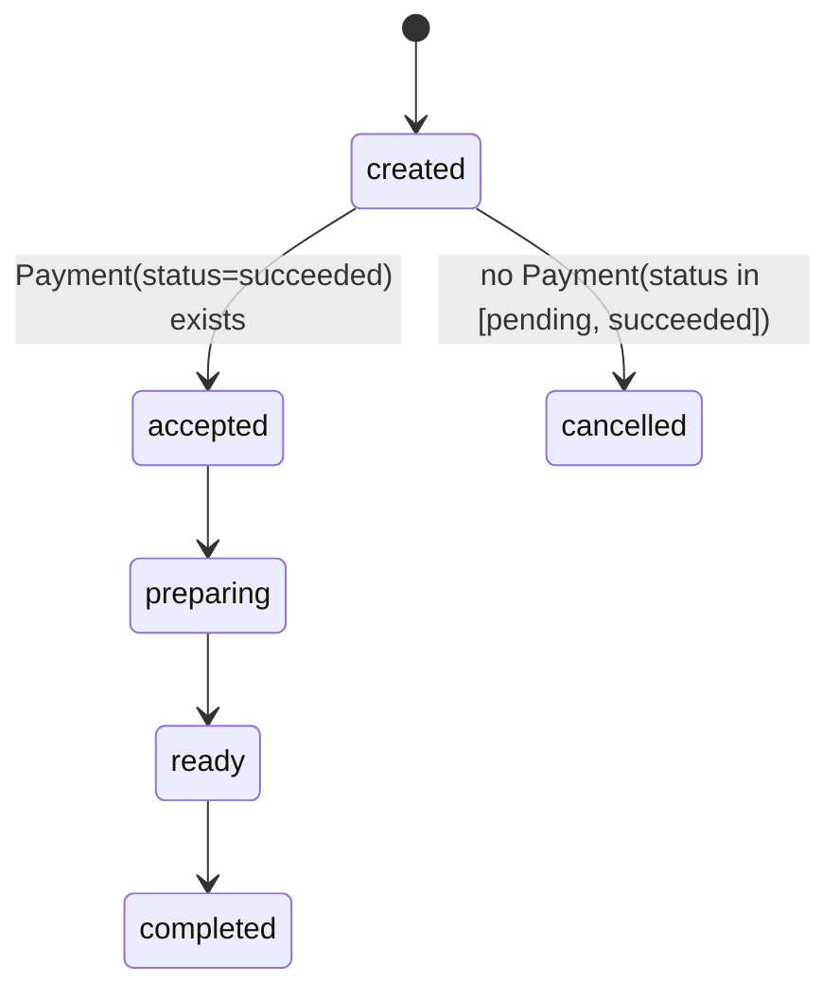
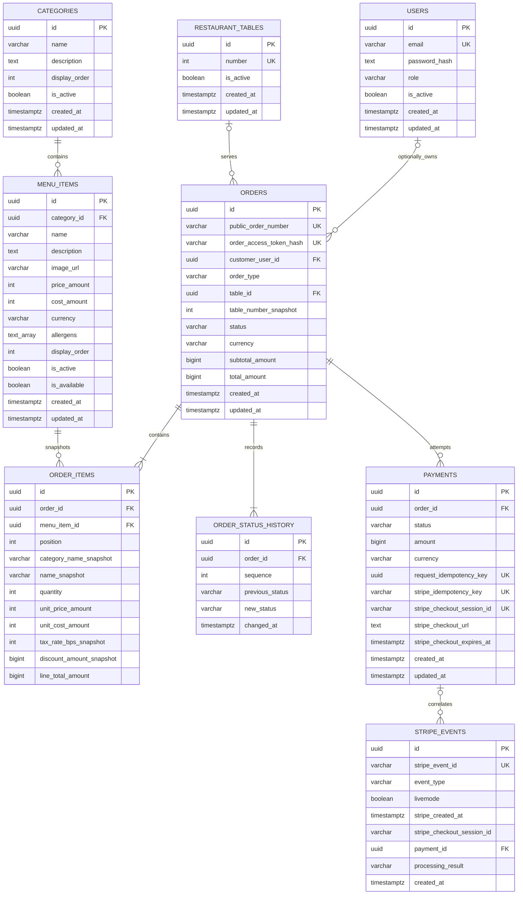
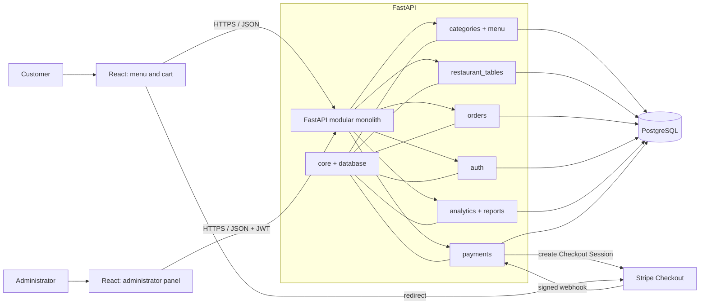

# System Architecture

## 1. Architectural Goals

The architecture must ensure financial data correctness, secure Stripe
integration, clear separation of responsibilities, and ease of demonstration.
The system remains simple enough for one person to develop and explain during a
job interview.

## 2. Selected Stack

### Backend

- Python 3.12 as the target version;
- FastAPI;
- Pydantic 2;
- SQLAlchemy 2;
- Alembic;
- PostgreSQL;
- pytest;
- Ruff, Black, and isort in accordance with repository rules.

### Frontend

- React;
- TypeScript;
- Vite;
- React Router;
- React Context for the cart and administrator session;
- CSS Modules and shared CSS design tokens;
- native `fetch`, `sessionStorage`, Vitest, and React Testing Library.

The implemented administrator frontend also uses React Context, native HTML/CSS,
and feature-local rendering; Zustand and Recharts were not required.

### Integrations and Infrastructure

- Stripe Checkout and Stripe webhooks in test mode;
- Docker and Docker Compose;
- GitHub Actions;
- planned hosting: Vercel for the frontend, Render for the backend, and Neon for
  PostgreSQL.

Hosting services are planned for the demo version and are not required for the
initial local stages. Their limitations and current terms must be reviewed
before the deployment stage.

## 3. Architecture Style: Modular Monolith

The backend is one application deployed as a single process, but the code is
divided by business capability. Modules communicate within the process and use
a shared PostgreSQL database. Module boundaries prevent accidental mixing of
responsibilities but do not create network boundaries between microservices.

Each module may contain only the elements it needs:

- SQLAlchemy models;
- Pydantic schemas;
- FastAPI routers;
- business logic;
- queries or data-access operations;
- tests.

A separate layer will not be created merely to pass through a single call.
Domain logic remains independent of FastAPI, Stripe, and interface-rendering
details where doing so improves testability.

## 4. Main Backend Modules

| Module              | Responsibility                                                                               |
| ------------------- | -------------------------------------------------------------------------------------------- |
| `core`              | configuration, security, shared errors, and cross-cutting concerns                           |
| `database`          | engine, sessions, model base, and migration integration                                      |
| `auth`              | unified User persistence, bootstrap, registration, sign-in, JWT, and role authorization       |
| `categories`        | categories and their order in the menu                                                       |
| `menu`              | menu items, prices, allergens, activity, and availability                                    |
| `restaurant_tables` | tables and dine-in order validation                                                          |
| `orders`            | quoting, orders, snapshots, public access, `order_status`, and its history                   |
| `payments`          | `Payment` attempts, Stripe sessions, `payment_status`, webhook verification, and idempotency |
| `analytics`         | KPI definitions and dashboard aggregations                                                   |
| `reports`           | filtered CSV exports                                                                         |

## 5. Flow Between Components

### 5.1. Menu Retrieval

React calls public FastAPI endpoints. The categories and menu modules read
active records from PostgreSQL. Active but unavailable items remain visible by
default, while an optional availability filter hides them. FastAPI returns
explicit public response schemas without administrative data.

### 5.2. Order and Payment

React submits only product identifiers, quantities, and order-type data.
FastAPI validates the data in PostgreSQL, calculates amounts, and stores the
order and snapshots without creating a `Payment` and without communicating with
Stripe. The response contains the `public_order_number` and, once, the raw
`order_access_token`.

A separate Checkout endpoint requires the `public_order_number` and
`Idempotency-Key`, and authorizes either the matching canonical owner or the
independent `X-Order-Access-Token` capability. It creates a
`Payment(status=pending)` for the amount stored on `Order`, then creates a
Stripe session. The same order and key pair cannot create another attempt or
session. Stage 9 implements this Checkout boundary, Stage 10 implements the
verified webhook boundary, and Stage 16E adds owner-or-capability access without
changing the financial state machine.

The Stripe call does not occur inside a database transaction. A short
transaction first locks `Order`, checks `Payment`, and stores the new attempt
and idempotency data. Stripe is called after the transaction commits. The
session identifier or failure outcome is stored in another short transaction,
again following the `Order -> Payment` order.

### 5.3. Authentication, Administration, and Analytics

The first-super-admin bootstrap flow is `CLI -> email normalization -> password
confirmation and policy validation -> Argon2id hashing -> short database
transaction -> transaction advisory lock -> existing-super-admin check -> User
insert -> commit`. Password and confirmation are read through `getpass`; no
password CLI argument, automatic account, or token is created. Normalization,
password validation, and hashing are application work performed before the
database critical section. The short transaction-level advisory lock serializes
only the race-sensitive check and insert. Customer and admin rows do not block
the first super-admin, while any active or inactive super-admin does. Concurrent
attempts therefore insert exactly one first super-admin.

Canonical registration creates only a customer. Canonical login and the legacy
administrator alias use exact User lookup plus real or dummy Argon2
verification. The administrator alias rejects a customer with the same generic
credential failure and production login routes issue only `user_access`.

The protected-request flow is `strict JWT validation -> current active User
SELECT -> database role check -> endpoint`. `get_current_user` accepts canonical
tokens, `require_admin` permits current `admin` or `super_admin`, and
`require_super_admin` permits only `super_admin`. Every request checks current
database state, so deactivation or a role change takes effect immediately.
Public routes are not globally protected. Operational orders, menu, analytics,
and reports use `require_admin`; role management uses `require_super_admin`.
React presents results but does not define permissions or KPI rules.

### 5.4. Independent Status Lifecycles

Each payment attempt has its own `payment_status`: `pending`, `succeeded`,
`failed`, or `expired`. Transitions are one-way and lead only from `pending` to
one of the terminal states. Retrying payment creates a new attempt record; it
does not change a completed record to `pending`.

The relationship is `Order 1:N Payment`. At most one `pending` attempt and at
most one `succeeded` attempt may exist for an order. A new attempt is allowed
only when neither status exists. PostgreSQL protects the constraints with two
partial unique indexes, while application logic handles conflicts between
concurrent requests. The source of payment confirmation is a related
`Payment(status=succeeded)` record, not an auxiliary value on `Order`.

Order fulfilment uses a separate `order_status`: `created`, `accepted`,
`preparing`, `ready`, `completed`, or `cancelled`. The allowed transition graph
is:



There are no backward transitions. `paid` and `pending_payment` are not part of
`order_status`. An `Order` may transition to `cancelled` only when no `Payment`
has status `pending` or `succeeded`. `failed`, `expired`, and the absence of
attempts do not block cancellation. An active `pending` attempt produces a
domain conflict with the provisional name `active_payment_attempt`; the
customer or administrator waits for the attempt to finish.

Checking `Payment` attempts and writing `order_status = cancelled` must be part
of one transactional operation. The logic reads state from the database and
does not trust status values submitted by the frontend. This prevents a race in
which an active Checkout Session ends with a later success webhook.

After successful payment, the order cannot be cancelled in the MVP; the
`accepted -> cancelled` transition does not exist. `order_status = cancelled`
does not change `payment_status`. The MVP does not automatically expire Stripe
sessions during cancellation and does not cancel an order with an active
session. Every `order_status` change is audited in the history. A future
`refund_status` will be a third, independent lifecycle and will allow later
design of paid-order cancellation.

### 5.5. Concurrency Control for Financial Operations

Order cancellation, creation of a new `Payment`, and Stripe webhook handling
serialize critical changes by locking the relevant `Order` record. Each flow:

1. starts a short transaction;
2. locks `Order`, for example with `SELECT ... FOR UPDATE`;
3. reads or locks related `Payment` records in a stable order;
4. checks invariants and idempotency;
5. stores the change;
6. commits the transaction.

The only allowed lock order is `Order -> Payment`. No flow may lock `Payment`
first and then wait for `Order`. Locking and state retrieval happen on the
backend; the frontend does not provide authoritative payment or order state.

Partial unique indexes for one `pending` and one `succeeded` payment per
`Order` remain a mandatory second line of protection. An index conflict is
handled explicitly and cannot result in a second attempt.

A transaction does not include waiting for Stripe. Checkout uses a stable
idempotency key and at least two short database phases: preparing the attempt
before the call and storing the result after the call. Every phase that changes
`Order` or `Payment` again follows `Order -> Payment` and rechecks the
invariants because state may have changed during the external operation.

Checkout same-key requests reuse one durable attempt and the stable Stripe key
`checkout-session:{payment_uuid}`. Concurrent requests with a different key
observe the existing pending attempt and fail without creating another one.
An incomplete pending attempt is eligible for provider replay for less than 23
hours. At or after that conservative cutoff, or after conflicting provider
state is observed, it remains pending for reconciliation; local time alone
never changes it to `expired`. Definitive provider rejection may mark the
attempt `failed`, while an ambiguous result stays `pending`.

### 5.6. Public Order Access

`Order` has a presentational `public_order_number` and a separate
`order_access_token` with at least 256 bits of randomness. The raw token is
returned only when the order is created. The database stores only its SHA-256
hash, and verification compares the calculated hash in constant time.

Public status retrieval requires the number and authorizes either a current
canonical User whose ID matches the persisted owner or a caller presenting the
valid `X-Order-Access-Token`. The capability stays independently valid for an
owned Order. An unknown number or denied owner/capability check produces the
same generic 404, never an ownership-revealing public 403. A present invalid
Bearer returns 401 before capability fallback. The response contains only the
public number,
`status`, order type, optional table-number snapshot, currency, public
historical item lines, totals, and creation and update timestamps. Stage 9 does
not add `payment_summary` even though Payment persistence now exists.

### 5.7. MVP Analytics

The implemented `backend/app/analytics/` package contains `router.py`,
`service.py`, `schemas.py`, and `__init__.py`. The router owns query validation,
the existing `require_admin` dependency, and the HTTP boundary only. Strict
Pydantic schemas require aware timestamps, expose integer minor-unit values,
and keep currencies separate. The service owns the shared qualified-payment
source and set-based PostgreSQL aggregation; it performs no DML, provider call,
or current-catalog join.

The shared source includes only `Payment(status=succeeded)` rows with a matching
StripeEvent for the same Payment, a transition-capable successful event type,
and `processing_result=transitioned`. Its authoritative success time is
`MIN(StripeEvent.stripe_created_at)`. A succeeded Payment without such a
receipt is excluded from time-bounded analytics; there is no fallback to
`Payment.updated_at`.

The six metrics are collected revenue, succeeded paid-order count, average
order value, product sales, category sales, and dine-in versus takeaway.
Revenue sums qualified `Payment.amount`, order count uses distinct
`Payment.order_id`, and average order value is rounded `ROUND_HALF_UP` per
currency in integer minor units. Product and category breakdowns aggregate
historical `OrderItem` snapshots; categories group by the historical name
because no historical Category UUID exists. Catalog mutations cannot rewrite
these results.

All four endpoints require aware `start` and `end`, filter the half-open
`[start, end)` interval as UTC instants, and return range metadata normalized
to `Europe/Oslo`. An optional strict uppercase three-letter currency filter is
supported. Currencies are never combined and no FX conversion is performed.

Overview and order-type endpoints each execute one set-based aggregate SELECT.
Product and category endpoints execute one set-based aggregate SELECT with
per-currency ranking through PostgreSQL window functions. Thus every endpoint
performs one analytics SELECT after authentication, with no N+1 queries,
Python full-table grouping, Pandas, DML, or Stripe network access.

The Stage 13 performance audit used EXPLAIN on isolated PostgreSQL and observed
the expected aggregates, joins, and window operations. Sequential scans on the
tiny test relations are not blocking. Existing indexes are sufficient for the
MVP single-restaurant scale, so no analytics persistence, materialized view,
new index, or migration was introduced by Stage 13. Migration 0007 was added
later by Stage 16D for unified identities. Index tuning is deferred until a
measured production-scale need exists.

Refunds are outside the MVP, so collected revenue is not automatically reduced
by refunds. Refund-adjusted revenue and other extended KPIs remain later work.

### 5.8. Implemented CSV Reports

The implemented `backend/app/reports/` package contains `__init__.py`,
`schemas.py`, `csv_utils.py`, `service.py`, and `router.py`. Schemas define
strict aware-range, uppercase-currency, order-status, and order-type query
contracts and reject unknown parameters. CSV utilities own UTF-8-SIG encoding,
the single BOM, comma/minimal-quoting/CRLF dialect, formula safety, NUL removal,
deterministic filenames, and Europe/Oslo datetime formatting. The service owns
set-based data retrieval and CSV row mapping. The router owns the existing
AdminBearer boundary and the CSV HTTP response headers.

The reports service reuses the analytics service's qualified
succeeded-Payment source. Product aggregation is also shared: Stage 13 JSON
applies a per-currency top-N rank, while product-sales CSV invokes the same
aggregation without a cutoff. Success-event qualification is therefore not
duplicated, and reports do not call analytics endpoints over HTTP.

The query boundary is one report SELECT after administrator authentication for
each dataset:

- `orders.csv` performs one Order SELECT over the half-open
  `Order.created_at` range and orders by creation time and internal ID;
- `product-sales.csv` performs one set-based aggregate SELECT over the shared
  qualified-Payment source and historical OrderItem snapshots;
- `payments.csv` performs one set-based qualified-Payment SELECT joined to
  Order only for the public order number.

All three paths perform zero DML, make no provider call, avoid N+1 queries, and
create no local CSV file. The response is generated completely in memory. This
has no silent truncation and is acceptable for the current single-restaurant
MVP scale; streaming and background exports remain deferred until measured
volume justifies them.

The Stage 14B-3 performance audit ran EXPLAIN for all three statements on
isolated PostgreSQL. The plans had no blocking issue, existing indexes were
sufficient for current scale, and sequential scans on tiny relations were not
a concern. Stage 14 introduced no index or migration; migration 0007 was added
later by Stage 16D. Future indexing, streaming, or background processing remains
measurement-driven rather than an unverified enterprise-scale claim.

### 5.9. Menu, Order, and Administrator Data Model



Category and MenuItem identifiers are UUIDs generated by the application.
`cost_amount` is nullable because an unknown cost differs from a known zero
cost. `text_array` in the diagram represents PostgreSQL `TEXT[]`, tracked by
SQLAlchemy `MutableList`. All monetary values use integer minor units.

The relationship uses `ON DELETE RESTRICT`, `passive_deletes="all"`, and no ORM
delete cascade. Names remain stored as provided, while functional indexes apply
`lower(btrim(name))` to enforce case-insensitive and trim-insensitive
uniqueness. `is_active` controls long-term visibility; MenuItem
`is_available` independently represents temporary sellability, so an active
item may remain visible while unavailable.

Stage 8 adds RestaurantTable, Order, OrderItem, and OrderStatusHistory. A
takeaway order has no table relationship or table snapshot. A dine-in order
references one RestaurantTable and stores its number independently as a
historical snapshot. Table and Order-aggregate foreign keys use
`ON DELETE RESTRICT`, and ORM aggregate relationships use no delete or
delete-orphan cascade. Stage 16E's ownership foreign key is the deliberate
exception: nullable `orders.customer_user_id` references `users.id` with
`ON DELETE SET NULL`, so a future User deletion can preserve the complete Order
history. No User-delete API currently exists, and there is intentionally no
User-to-Order ORM ownership relationship.

Migration `0008_add_order_ownership`, whose parent is
`0007_unify_user_auth_roles`, adds ownership with no default, data rewrite, or
backfill. Historical Orders remain NULL and there is no fake guest User, guest
role, or retroactive claim. The one non-unique
`ix_orders_customer_user_created_at_id` index covers
`(customer_user_id, created_at, id)`. It supports owner filtering and backward
index traversal for deterministic `created_at DESC, id DESC` account history;
there is no redundant `customer_user_id`-only index.

OrderItem deliberately denormalizes category name, item name, quantity, unit
price, nullable unit cost, tax-rate placeholder, discount placeholder, and line
total. The Order stores currency, subtotal, and total. Derived totals use
`BIGINT`; Stage 8 stores no tax calculation and no discount calculation.
Historical snapshots are not changed by later MenuItem, Category, or
RestaurantTable updates.

Stage 9 adds `Payment` as one persisted Checkout attempt in the
`Order 1:N Payment` relationship. The Order foreign key uses
`ON DELETE RESTRICT`; the ORM has `passive_deletes="all"` and no delete or
delete-orphan cascade. `UNIQUE(order_id, request_idempotency_key)` scopes
request replay to one Order, while Stripe idempotency keys and non-null Checkout
Session IDs are globally unique. Partial unique indexes enforce at most one
`pending` and one `succeeded` attempt per Order. The non-unique
`(order_id, created_at, id)` index gives deterministic payment history access.
Checkout fields are either all null or all populated, amount is positive, and
currency is exactly three uppercase ASCII letters.

Stage 10 adds StripeEvent as a durable receipt for one in-scope provider event.
The globally unique `stripe_event_id` makes redelivery idempotent across process
restarts. `payment_id` is nullable so an authentic event with unknown or
malformed correlation can still be retained for reconciliation; when present,
its Payment foreign key uses `ON DELETE RESTRICT`. Check constraints limit event
types and processing results and reject blank event and Checkout Session IDs.
The `(payment_id, stripe_created_at, id)` and
`(stripe_checkout_session_id, stripe_created_at, id)` indexes support ordered
history access.

Stage 11 originally adds `admin_users`; Stage 16D migration 0007 evolves it into
the unified `users` table. A User has an application-generated UUID, unique
normalized lowercase email, nonblank Argon2id hash, active flag, aware
timestamps, and exactly one constrained role: `customer`, `admin`, or
`super_admin`. The role is a `VARCHAR`, is non-null, has a database `CHECK`, and
has no server default. There is no Role table, join table, token version, reset,
MFA, plaintext password, or relationship to guest orders. `AdminUser` is only a
temporary Python import alias for this mapped User.

### 5.10. Local Demonstration Seed

The seed has an immutable, typed data layer containing fixed UUIDs and a
transactional runner that performs normalized-name preflight checks followed by
conditional PostgreSQL primary-key upserts. One transaction contains every
preflight and write. Seed ownership is limited to the approved fixed UUIDs;
unrelated records are never deleted, replaced, or claimed by name.

The explicit `python -m app.seed` CLI is a local-only integration boundary. It
validates the exact development database allowlist before creating an Engine.
Imports have no side effects, and the seed has no application startup,
migration, Docker Compose, CI, deployment, or other automatic hook. Conditional
`IS DISTINCT FROM` updates restore canonical values while preserving
`created_at` and avoiding an `updated_at` change for a no-op rerun.

### 5.11. Implemented Public Menu API

The FastAPI application is created through an injectable app factory. Its
lifespan creates one synchronous SQLAlchemy Engine and session factory for a
normal application run, stores the factory in application state, and disposes
the owned Engine at shutdown. Tests may inject a session factory whose Engine
lifecycle remains owned by the fixtures. Importing the application does not
connect, query, migrate, or seed.

A request dependency creates and closes one synchronous Session without an
automatic commit. The public menu router is mounted at `/api/v1/menu` and uses
five strict Pydantic response schemas. The schemas are populated explicitly;
ORM entities are not serialized, so `cost_amount`, timestamps, internal
activity state, and raw product category identifiers cannot leak into the
contract.

The read-only query layer uses two column-level SELECT statements for a
non-empty menu: one for active categories and one for active items. If no
active category exists, only the category SELECT runs. Item details use one
column-level SELECT with a Category join. This avoids lazy loading and N+1
access while keeping database work independent of FastAPI.

The default list and detail view include active but unavailable items with
`is_available=false`; `available_only=true` removes unavailable items from the
list. Inactive categories, their items, inactive items, and categories without
visible items are omitted. Categories and items are ordered by
`display_order`, then UUID. This read path does not change the Stage 4 ERD.

### 5.12. Implemented Order Quoting

The `orders` package retains a separate public quote use case with request and
response schemas, a FastAPI-independent quoting layer, and the
`/api/v1/orders/quote` route. Quote remains transient even though the package
now also contains persistent Stage 8 order models and creation logic.

The request accepts only unique menu item identifiers and quantities. The
quoting layer executes one explicit column-level SELECT joining `MenuItem` and
`Category`, then validates item activity, category activity, and availability
in request order. Mixed currency is checked only after all item-level
validation succeeds. The response preserves request order.

All price calculations use Python integers and minor units. Names, unit prices,
and currency come from the database. The quote is a transient point-in-time
snapshot with no identifier, timestamp, expiry, persistence, or reservation.
The operation executes zero writes and does not alter the Stage 4 ERD.

The router maps missing and non-public items to 404, unavailable items to 409,
mixed currencies to a distinct 409 detail, and request validation to the
standard 422 response. Order creation ignores previous quote responses,
re-reads all authoritative menu state, and creates durable snapshots only when
an Order is persisted.

### 5.13. Implemented Order Creation and Public Status

`create_order()` owns one short synchronous `Session.begin()` transaction. It
revalidates server-authoritative MenuItem and Category activity, availability,
names, prices, costs, and currency. Requests contain only order type, optional
table number, identifiers, and quantities. The transaction writes one Order,
ordered OrderItem snapshots, and the initial `created` history entry, then
builds the public response after commit. Any validation or persistence failure
rolls back the complete aggregate.

Dine-in creation locks and validates RestaurantTable with `FOR SHARE` before
locking MenuItem and Category rows. Menu rows are locked in deterministic
MenuItem UUID order. Takeaway performs one locked SELECT; dine-in performs the
table SELECT followed by the menu/category SELECT. Shared locks permit
concurrent independent creations while blocking conflicting source updates or
deletes until the creation transaction ends.

Optional canonical authentication is resolved after the creation limiter. An
absent Authorization header enters the guest path without requiring the auth
service or a User query. A valid `user_access` reloads the current active User;
any present malformed, invalid, legacy, inactive, or missing-User credential
returns 401 rather than falling back to guest. Auth configuration or User-query
failure returns a safe 503.

The trusted `customer_user_id` or NULL is written in the initial Order
constructor inside the same aggregate transaction, not through a follow-up
UPDATE. The public request cannot supply an owner, and current public/account
routes cannot mutate or claim ownership. The creation response contains the
one-time raw guest capability and a presentational public number for every
Order; only the SHA-256 capability hash is persisted. Public status reads the
Order and item snapshots through explicit column-level queries, applies the
role-independent owner-or-constant-time-capability decision before reading
items, executes no writes, and exposes no owner, internal Order UUID,
OrderItem ID, cost, token hash, Payment, or Stripe field.

The app-scoped fixed-window limiter allows 10 creation attempts per 60 seconds
for each direct `request.client.host`. It is thread-safe, per process, resets on
restart, has an injectable monotonic clock, and returns a positive
`Retry-After`. Forwarded headers are intentionally ignored until a trusted
proxy configuration exists. Stage 8 has no creation idempotency: each valid
POST creates a distinct Order.

The pure cancellation policy allows only an Order in `created` without a
blocking payment to be cancelled. Stage 9 verifies D-016 against persisted
Payment rows and verifies the D-017 `Order -> Payment` lock protocol through
PostgreSQL integration and concurrency tests. The administrative cancellation
command itself remains part of the later operational API stage.

### 5.14. Implemented Stripe Checkout

The `payments` module separates persistence, pure status policy, strict public
schemas, the Stripe adapter, orchestration, and the FastAPI transport. The
official Stripe Python SDK is constrained to `stripe>=15.4.0,<16`. An
app-scoped `StripeClient` holds its own secret instead of mutating a global SDK
key, and automated tests inject a narrow fake client that performs no network
request.

`POST /api/v1/orders/{public_order_number}/checkout-session` has no request
body. It requires a canonical lowercase hyphenated UUIDv4 `Idempotency-Key` and
authorizes the matching canonical owner or a valid independent
`X-Order-Access-Token`. The server owns amount and currency and creates one
hosted `mode=payment` line item. Safe metadata contains only internal Order and
Payment identifiers and the public order number; it contains no guest token.
Redirect templates accept an absolute HTTP(S) URL with at most the approved
`{public_order_number}` placeholder.

The exact transport and financial ordering is request/idempotency validation,
rate limiting, optional canonical User resolution, a short transaction,
`Order SELECT ... FOR UPDATE`, owner-or-capability authorization, and only then
the existing Payment query/lock/mutation. User resolution uses a separate short
session and takes no User lock, so it introduces no `User -> Order` lock edge.
Denied access performs no Payment query or mutation, provider call, or persisted
idempotency work. Phase 1 then rejects a non-`created` fulfilment state or
returns, selects, or creates the durable attempt. The Stripe call occurs only
after commit, with no database transaction or row lock. Short post-provider
transactions again lock `Order -> Payment`, recheck invariants, and store or
reconcile the result without overwriting conflicting state.

The endpoint returns 201 for a newly persisted attempt and 200 for an
idempotent replay. Stable errors cover authentication 401, access 404, state
409, invalid-key 422,
rate-limit 429 with `Retry-After`, definitive-provider 502, and local,
ambiguous, or reconciliation 503 outcomes. The independent app-scoped checkout
limiter permits 10 attempts per 60 seconds per direct peer host before any SQL.
Checkout URLs are sensitive and must not be logged. The public response exposes
no internal IDs, Stripe Session ID, idempotency key, guest credential, or token
hash.

Stage 9 creates `pending` and may persist `failed`. Stage 10 now verifies
webhooks and owns provider-confirmed `succeeded`, `failed`, and `expired`
transitions. If a webhook succeeds after the provider call but before Checkout
Phase 3, Phase 3 may fill the complete all-null provider session tuple for that
exact already-succeeded Payment without regressing its status. The same fill is
forbidden after `failed` or `expired`.

### 5.15. Implemented Stripe Webhook

`POST /api/v1/stripe/webhook` is a provider-facing asynchronous route hidden
from OpenAPI. It reads `request.body()` exactly once and passes the unchanged
bytes and `Stripe-Signature` header to `StripeWebhookVerifier`. The adapter uses
the official Stripe SDK with a 300-second default tolerance and returns either
minimal immutable Checkout facts or an ignored out-of-scope event. It performs
no provider network request.

For an in-scope event, the webhook service parses internal metadata and starts a
short transaction. A known correlation locks Order first, then all related
Payments with `FOR UPDATE` ordered by `created_at, id`. It rechecks event-ID
idempotency, validates Payment ID, Order ID, public number, Checkout Session ID,
mode, amount, and currency, then inserts the StripeEvent receipt atomically with
any Payment transition. Unknown correlation uses a short PostgreSQL
`INSERT ... ON CONFLICT DO NOTHING` transaction and stores a nullable-Payment
reconciliation receipt without inventing a Payment.

Completed paid and asynchronous-success events may transition pending to
`succeeded`; asynchronous failure may transition it to `failed`; an unpaid
expired session may transition it to `expired`. Completed unpaid remains
pending with `awaiting_async_payment`. The first terminal result wins, so later
contradictory events are durably receipted as `reconciliation_required` without
changing Payment. Signed out-of-scope events are acknowledged without a
receipt, while sequential and concurrent duplicates converge on one receipt.

The shared `Order -> Payment` lock order is also used by Checkout and the future
cancellation transaction. PostgreSQL concurrency tests cover duplicate races,
opposing terminal events, webhook-before-Checkout-Phase-3, and webhook versus
future cancellation without deadlocks.

### 5.16. Implemented Unified Authentication and Role Authorization

pwdlib uses Argon2id with memory cost 19456 KiB, time cost 2, parallelism 1,
and a library-generated salt. Bootstrap accepts 15 through 128 Unicode code
points without trimming or composition rules. Login accepts 1 through 128 code
points and performs one process-local, lazily generated dummy verification when
the normalized identity is absent. No static dummy credential or hash exists.

The token service uses only HS256 and requires at least 32 UTF-8 bytes of key
material. Tokens contain exactly `sub`, `type`, `iat`, `exp`, `iss`, and `aud`;
the subject is a canonical User UUID. Canonical `user_access` and temporary
legacy `admin_access` have strict distinct audiences. Production login routes
issue only `user_access`; legacy tokens are validation-only compatibility. No
token contains role authority. The default lifetime is 30 minutes and
configuration permits 1 through 60 minutes. There is no refresh, revocation,
logout, password reset/change, or MFA.

`POST /api/v1/auth/register`, `POST /api/v1/auth/login`, and
`GET /api/v1/auth/me` are the canonical contracts. Registration always creates
an active customer and rejects privilege fields. The existing
`POST /api/v1/admin/auth/login` alias delegates to unified authentication,
accepts only admin or super-admin, and issues `user_access`. The canonical and
alias login endpoints share one app-scoped fixed-window limiter allowing five
attempts per 60 seconds for each direct peer. Registration has a separate
limiter. Both ignore `X-Forwarded-For`.

`GET /api/v1/admin/auth/me` remains a compatibility alias. Every protected auth
request reloads the current User and active state. Missing, malformed, expired,
or otherwise invalid tokens and missing or inactive identities share a
Bearer-challenged 401; an authenticated insufficient role returns 403. The auth
service is optional at general startup when no JWT secret is configured, but
protected auth operations then return 503. The Stripe webhook remains hidden.

Canonical configuration uses `AUTH_JWT_SECRET` and
`AUTH_ACCESS_TOKEN_EXPIRE_MINUTES`. `ADMIN_JWT_SECRET` and
`ADMIN_ACCESS_TOKEN_EXPIRE_MINUTES` remain temporary input aliases. Either
family alone works, equal dual values are accepted, and conflicting dual values
fail safely without exposing the secret.

### 5.17. Implemented Administrator Operational API

Stage 12 keeps HTTP, validation, and database responsibilities separated. The
orders module uses `admin_router.py`, `admin_schemas.py`, and
`admin_service.py`; the menu module uses the corresponding `admin_*` files.
Routers apply `require_admin` and map stable HTTP errors. Services contain no
FastAPI or JWT logic and return strict detached response schemas.

Administrator order reads use one count and one deterministic page query for
the list, while detail reads the Order, immutable OrderItem snapshots, ordered
history, and ordered Payment summaries without N+1 loading. The summary omits
StripeEvent data, Checkout URLs, Session IDs, idempotency keys, and guest access
material.

Status mutation starts a short transaction and locks the Order with
`FOR UPDATE`. The transition graph is checked before payment reads.
Payment-sensitive acceptance and cancellation then lock related Payments in
`created_at, id` order, preserving the shared `Order -> Payment` protocol.
Acceptance requires a succeeded attempt. Cancellation preserves D-016: pending
and succeeded attempts block it, while failed, expired, or absent attempts do
not. The Order status update and exactly one history insert commit atomically;
the Order lock serializes the next history sequence. No Stripe provider call is
made while these locks are held, and Stage 12 adds no actor field.

Administrator menu lists use one count and one deterministic page query and
include inactive resources. Create and PATCH operations use short transactions;
PATCH locks its target row with `FOR UPDATE`. PostgreSQL normalized unique
indexes remain the final arbiter for global category names and category-scoped
menu-item names. Known uniqueness violations alone become 409 conflicts.
Category and item changes are soft: there is no DELETE, item activity and
availability remain independent, category deactivation does not rewrite child
flags, and historical OrderItem snapshots remain unchanged. The separate public
menu router stays unauthenticated and retains its existing visibility rules.

Stage 12 changes no SQLAlchemy model and requires no migration after
`0006_create_admin_user_model`. RestaurantTable administration, refunds,
StripeEvent diagnostics, a generic audit log, and analytics remain outside this
operational API.

### 5.18. Implemented Administrator Frontend Runtime

The administrator frontend is grouped around explicit trust and feature
boundaries:

```text
frontend/src/
|-- api/adminApi.ts
|-- components/admin/
|-- features/admin-auth/
|-- features/admin-orders/
|-- features/admin-menu/
|-- features/admin-analytics/
|-- features/admin-exports/
`-- routes/adminRoutes.tsx
```

`adminApi.ts` owns one canonical `/api/v1/admin/...` validator, Bearer-header
creation, timeout/abort classification, and shared execution for JSON and Blob
responses. Feature modules use native `fetch` only through this transport and
strict feature-local parsers or request builders. There is no global Bearer
interceptor, and customer/public transports cannot receive the administrator
credential.

`AdminAuthContext` keeps the current opaque token in memory and uses the exact
versioned `restaurant-ordering:admin-auth:v1` `sessionStorage` record containing
only `version` and `accessToken`. A storage failure leaves a newly authenticated
current-tab session usable in memory. `AdminRouteGuard` requires successful
`/api/v1/admin/auth/me` validation before rendering `AdminShell`; a 401 clears
the session, while a network or 503 validation failure preserves it behind an
explicit retry state. The app never uses `localStorage`, and the token is never
placed in a URL, DOM node, or log. Frontend logout clears this state because the
current backend has no logout endpoint. The backend already issues canonical
`user_access` from the legacy login alias; migration to the shared browser
AuthContext remains Stage 16F.

Order list/detail views remain read-only except for explicit detail actions
derived from the current status. Mutation requires inline confirmation and
allows one PATCH in flight. The client performs no optimistic update and creates
no history or Payment representation. Success is followed by authoritative GET
refetch. PATCH success followed by GET failure is distinguished from a failed
PATCH; network, timeout, uncertain server failure, and unresolved 409 outcomes
activate a refresh gate before another action.

Menu administration uses GET/POST/PATCH only. PATCH bodies contain changed
fields only, and no optimistic mutation is applied. An ambiguous result requires
Refresh before resubmission. Money fields remain integer minor units, inactive
categories returned by the backend remain operationally selectable for item
reassignment, and catalog changes never rewrite historical OrderItem snapshots.

The shared reporting date helper accepts only date values, computes
Europe/Oslo local midnight with an explicit offset, and converts the selected
inclusive end date to the next local midnight for an aware half-open
`[start, end)` query. It is DST-tested and independent of the host local time
zone; `datetime-local` is not used. Analytics starts four requests in parallel
under one generation AbortController, ignores stale generations, preserves
section-level partial results, and performs no polling or automatic retry.
Currency groups remain isolated and are never combined or converted.

CSV exports use GET-only `adminRequestBlob`, sharing the JSON transport's path
and Bearer boundary with a 30-second timeout. The export layer validates a
case-insensitive `text/csv` media type but leaves Blob bytes unparsed. The
download helper accepts only a short quoted ASCII `.csv` filename or uses a
fixed report fallback, clicks one temporary link, and always removes the link
and revokes the object URL. No Blob or object URL is persisted.

### 5.19. Implemented Customer Frontend Runtime

Stage 15 established a guest-only React and TypeScript client. Its
feature directories are `menu`, `cart`, `checkout`, and `order-status`.
`src/api` owns transport and strict runtime response validation,
`src/components` owns genuinely shared shell and notice components,
`src/routes` owns the public route table, and `src/styles` owns global tokens
and base rules. Stage 16 has since added the implemented administrator frontend
described above. No customer-account state exists.

The browser is not a pricing or lifecycle authority. It sends item identifiers,
quantities, order type, and an optional dine-in table number; FastAPI supplies
menu facts, validates the current quote and order, owns all money, and owns
Order and Payment state. The public guest credential is returned once by order
creation and sent only in `X-Order-Access-Token`. It is never part of a URL,
rendered DOM, or log.

Browser persistence is limited to `sessionStorage` with these exact versioned
keys:

- `restaurant-ordering:cart:v1`;
- `restaurant-ordering:order-access:v1:<PUBLIC_ORDER_NUMBER>`;
- `restaurant-ordering:checkout-attempt:v1:<PUBLIC_ORDER_NUMBER>`.

The cart record contains only menu-item identifiers and quantities. The order
access record contains the guest credential for the current session. The
Checkout record contains the public order number and canonical UUIDv4
idempotency key, but no guest token, Checkout URL, Stripe identifier, or
Payment identifier. The app never uses `localStorage`. Malformed persisted
records are discarded; storage failures such as `SecurityError` leave the
current in-memory flow usable where an in-memory value already exists.

The API layer accepts only paths below `/api/` and classifies failures as
`http`, `network`, `timeout`, `aborted`, or `invalid-response`. Feature layers
map those transport facts to safe customer messages; raw backend details are
not rendered. Quote changes use a 400 ms debounce plus AbortController cleanup.
Order creation is never automatically retried after an ambiguous outcome.
Checkout preserves its idempotency key for network, timeout, 429, 503, and
redirect failures and replaces it only through explicit customer action after
a definitive 502.

Fulfilment polling performs one request at a time. It requests immediately,
schedules the next normal request 8 seconds after settlement, and uses bounded
8, 16, and 30 second delays after transient failures. It pauses when the page
is hidden or offline, resumes immediately only when visible and online, and
stops for `completed`, `cancelled`, privacy-preserving 404, or an invalid
response contract. AbortController cleanup and the active effect generation
prevent stale updates. Stage 15 uses no WebSocket or server-sent event channel.

During local development the network path is `Browser -> Vite :5173 -> /api
proxy -> FastAPI 127.0.0.1:8000`. The default `VITE_API_BASE_URL` is empty, so
requests remain same-origin through the Vite proxy and no local CORS middleware
is required. Cross-origin production policy is deferred to deployment.

### 5.20. Unified Identity, Order Ownership, and Account Privacy Boundary

Stage 16D implements one minimal registered identity:

```text
User
- id: UUID
- email: normalized unique email
- password_hash: Argon2id hash
- role: customer | admin | super_admin
- is_active: boolean
- created_at: aware UTC timestamp
- updated_at: aware UTC timestamp
```

`role` is a Python `StrEnum` represented by a non-null `VARCHAR` column, with no
server default and with a database `CHECK` constraint. It is one mutually
exclusive role, so there is no Role table, role join table, or multi-role RBAC
layer. An anonymous `guest` is neither a User nor a role. Public registration
creates only `customer`; no request field can select `admin` or `super_admin`.

JWT access tokens identify a User. PostgreSQL is authoritative for current role
and `is_active` on every protected request. Implemented dependencies are:

- `get_current_user` accepts canonical `user_access` only for any active User;
- `require_admin` accepts strict `user_access` or temporary strict
  `admin_access`, reloads the User, and permits `admin` or `super_admin`;
- `require_super_admin` uses the same current-User authority and permits only
  `super_admin` for role management;
- no Bearer requirement for anonymous guest ordering.

An invalid, missing, inactive, or deleted identity returns 401; a valid identity
with insufficient role returns 403 on role-protected administrator routes.
Stage 16E public Order routes instead use optional canonical authentication:

- a completely absent Authorization header selects the guest path before auth
  service or User database lookup;
- a present valid canonical `user_access` resolves the current active User;
- a present malformed, invalid, legacy `admin_access`, inactive, or missing-User
  credential returns 401 with no silent guest fallback;
- auth configuration or User lookup failure returns a safe 503;
- creation and Checkout run their existing rate limiters before optional User
  resolution.

The planned Stage 16F browser transport preserves explicit trust boundaries:

- `publicApi` sends no Bearer token;
- `authenticatedApi` may send Bearer only to an explicit account-route
  allowlist and to optional authenticated Order creation;
- `adminApi` may send Bearer only to `/api/v1/admin/...`;
- no global interceptor may attach the account token to arbitrary requests.

Guest Checkout and public status continue to use `X-Order-Access-Token`; a
canonical account token does not replace this per-Order capability. Ownership
and capability are independent. Public status and Checkout permit access only
when `current_user_id` matches the non-NULL persisted `customer_user_id` or the
guest capability verifies in constant time. An owner can omit or mistype the
capability; an anonymous or authenticated non-owner can still use a valid
capability. A non-owner without it receives the same 404 as an unknown Order,
never an ownership-revealing public 403. There is no role-based public bypass.

The ownership extension is nullable
`Order.customer_user_id -> User.id` with `ON DELETE SET NULL`, no default,
backfill, or ORM relationship. Anonymous Orders store NULL; creation writes a
trusted current User ID, when any, in the initial aggregate transaction. Every
Order still gets an independent raw-once capability whose hash is persisted.
No client field, public response, or current route can set, mutate, or
retroactively claim ownership. A future User deletion may null ownership while
preserving the Order; no User-delete API currently exists.

Migration `0007_unify_user_auth_roles` renames and evolves `admin_users` into
`users`, preserving UUID, normalized email, password hash, active state, and
timestamps. It adds the constrained role column and maps exactly one historical
administrator to `super_admin`. Zero rows are valid for later bootstrap; more
than one makes the migration fail atomically. Downgrade is guarded against
discarding customer data. Migration validation uses only the disposable exact
test database on the project PostgreSQL listener at 5433; it does not mutate the
development database or host PostgreSQL at 5432.
Migration `0008_add_order_ownership` is the schema-only child of 0007 and adds
the nullable foreign key plus the composite owner-history index. Repository and
Alembic head are 0008, while the local development database deliberately
remains at 0006 until a separately approved `0006 -> 0007 -> 0008` migration
operation.

Public registration always creates `customer`. The super-admin-only list API
returns safe User fields and deterministic pagination. Its role PATCH locks the
target row and allows only `customer <-> admin`; it cannot assign or modify a
`super_admin`, mutate active state, or delete a User. The `/admin/users`
frontend is not implemented. Order ownership and account Order-history API are
implemented in Stage 16E; the shared authentication, account, and administrator
User-management frontend remains planned for Stage 16F.
Because every protected request reloads the User, a successful role change
affects authorization immediately even when the client reuses the same token.

The account boundary exposes exactly two strict canonical read-only routes:
`GET /api/v1/account/orders` and
`GET /api/v1/account/orders/{public_order_number}`. Every active role has
personal scope only. Both the count and page SELECT apply the current User owner
predicate; the page orders by `created_at DESC, id DESC` with default
`limit=50`, maximum 100, and default `offset=0`. Detail combines
`public_order_number` and `customer_user_id` in the same SQL predicate rather
than fetching broadly and filtering in Python. Cross-user, unowned, and unknown
details share one 404, and a guest capability is irrelevant to account
authorization.

The account list uses a dedicated seven-field safe DTO. Account detail reuses
the same query-free `OrderStatusResponse` builder as public status after the
caller has already authorized and projected the row. The builder serializes
only approved snapshots; it performs no authentication, authorization, or
database work and exposes no owner, PII, capability, Payment, or Stripe data.
Existing administrator Order DTOs remain unchanged and likewise do not expose
ownership.

## 6. Architecture Diagram



## 7. Planned Backend Structure

The structure is a direction, not an instruction to create every file at once.
Each stage adds only the elements it needs.

```text
backend/
├── alembic/
│   └── versions/
├── app/
│   ├── auth/
│   ├── categories/
│   ├── menu/
│   ├── restaurant_tables/
│   ├── orders/
│   ├── payments/
│   ├── analytics/
│   ├── reports/
│   ├── core/
│   ├── database/
│   └── main.py
├── tests/
│   ├── unit/
│   ├── integration/
│   └── api/
├── alembic.ini
└── pyproject.toml
```

Files such as `models.py`, `schemas.py`, `router.py`, and `service.py` are
allowed within a module, but they are created only when the module actually
needs the relevant responsibility.

## 8. Implemented Stage 15 Customer Frontend Structure

```text
frontend/
├── src/
│   ├── api/
│   ├── components/
│   ├── features/
│   │   ├── menu/
│   │   ├── cart/
│   │   ├── checkout/
│   │   └── order-status/
│   ├── routes/
│   ├── styles/
│   ├── test/
│   ├── App.tsx
│   └── main.tsx
├── index.html
├── package.json
├── tsconfig.json
└── vite.config.ts
```

Code is grouped primarily by feature. Shared components are placed in
`components` only when they are genuinely shared. The tree above records the
Stage 15 baseline. Stage 16 has since added the complete administrator auth,
shell, orders, menu, analytics, and exports implementation described in Section
5.18; user-performed manual responsive acceptance passed at the required
mobile, tablet, and desktop viewports.

## 9. Trust Boundaries and Data Integrity

- The browser is untrusted: prices, roles, and status transitions are verified
  by the backend.
- Stripe is an external integration: every webhook requires signature
  verification, and the event identifier has a unique constraint.
- Critical order, payment, and history writes are transactional.
- Cancellation, `Payment` creation, and the webhook lock `Order` first and then
  `Payment`; no lock is held during a Stripe call.
- Administrator menu PATCH operations lock the target Category or MenuItem row;
  database uniqueness remains authoritative for concurrent writes.
- The database enforces foreign keys, uniqueness, and valid constraints
  independently of Pydantic validation.
- Partial unique indexes limit `Payment` attempts with status `pending` and
  `succeeded` to one each per `Order`.
- UUIDs are internal primary keys; public access to order status requires the
  `public_order_number` and either matching canonical ownership or a capability
  whose raw value is not stored.
- Customer state uses current-session storage only. No guest credential or
  Checkout URL is placed in a URL, persistent local storage, rendered DOM, or
  application log.
- Secrets do not enter the repository, the frontend image, or logs.

## 10. API Scope

The public scope includes a health check, categories, menu, quoting, order
creation, Checkout Session creation, restricted status retrieval, and the
implemented provider-facing Stripe webhook. `POST /api/v1/orders` does not
create a payment. Order creation, public status, and Checkout advertise
`UserBearer OR anonymous`; an absent Bearer uses the guest path, while a valid
canonical User may own or access its Order. Status and Checkout also accept the
independent `X-Order-Access-Token`. Checkout still requires `Idempotency-Key`;
the path parameter is the returned public number, not an internal UUID.
`POST /api/v1/orders/quote` has no security requirement.
`POST /api/v1/stripe/webhook` requires a valid Stripe signature and is
intentionally absent from OpenAPI.

The implemented unified identity scope includes `POST /api/v1/auth/register`,
`POST /api/v1/auth/login`, and `GET /api/v1/auth/me`. Administrator login and me
aliases remain compatible. The administrator scope also includes order list and
detail, fulfilment status changes, category and menu-item management, four
protected analytics endpoints for the six basic KPIs, exactly three protected
CSV exports, and super-admin-only `GET /api/v1/admin/users` and
`PATCH /api/v1/admin/users/{user_id}/role`. Existing operational contracts now
use database-backed unified User role checks.

The account scope contains exactly strict-UserBearer
`GET /api/v1/account/orders` and
`GET /api/v1/account/orders/{public_order_number}`. It has no anonymous or
AdminBearer alternative, ownership claim, mutation, or guest-capability bypass.
No other Stage 16E route is introduced.

Exact contracts, response codes, and the access policy will be defined in the
stages that implement the relevant features. The context document is not yet a
frozen OpenAPI specification.

## 11. Matters Resolved Before the Data Model

- O-002 separates storing `Order` from creating `Payment` and a Stripe Checkout
  Session and defines retry idempotency.
- O-003 defines a separate access token, storage of only its hash, and a minimal
  public status contract.
- O-001 together with D-012, D-013, and D-016 defines independent status
  lifecycles, cancellation rules, and `Order 1:N Payment` invariants.
- D-017 defines the shared serialization point, the `Order -> Payment` lock
  order, and the transaction boundary relative to Stripe.
