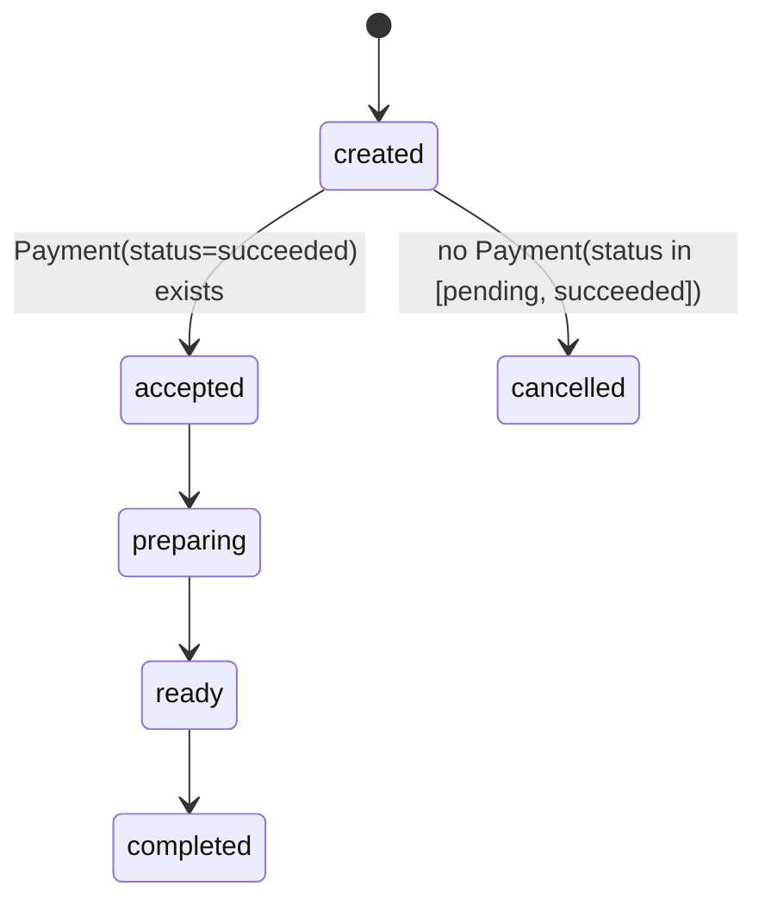
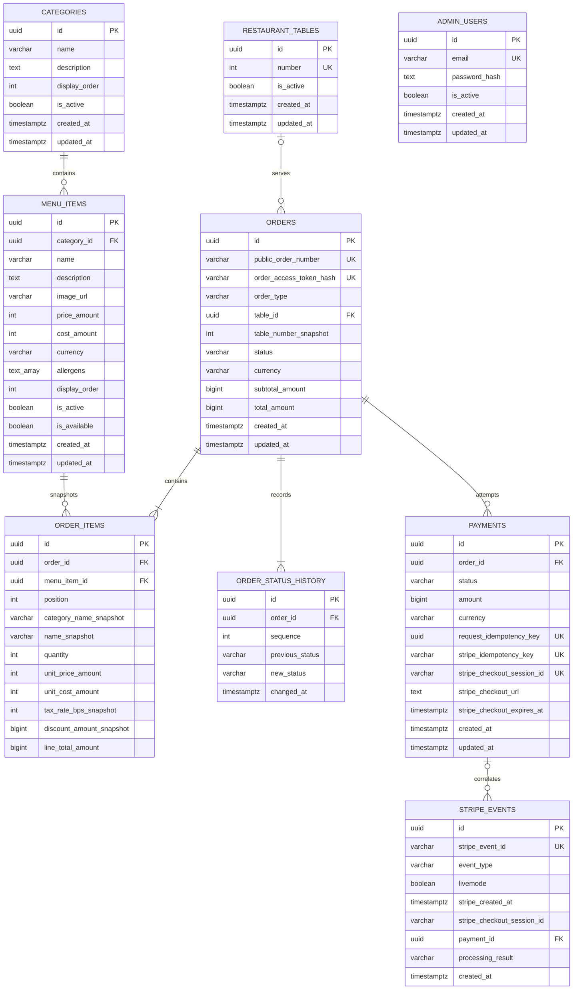
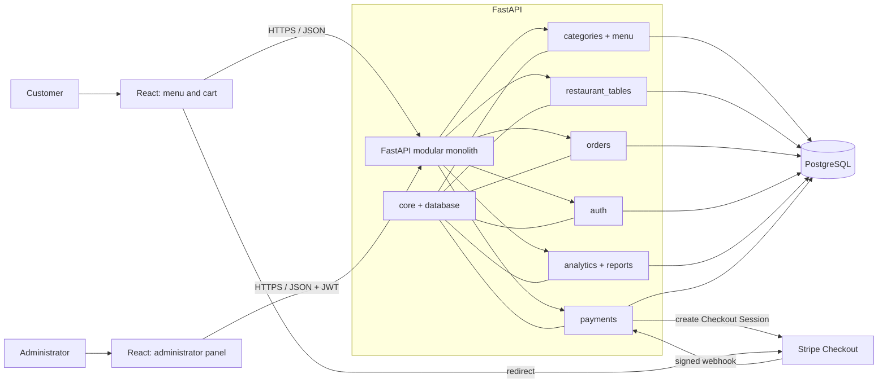

# System Architecture

## 1. Architectural Goals

The architecture must ensure financial data correctness, secure Stripe
integration, clear separation of responsibilities, and ease of demonstration.
The system remains simple enough for one person to develop and explain during a
job interview.

## 2. Selected Stack

### Backend

- Python 3.12 as the target version;
- FastAPI;
- Pydantic 2;
- SQLAlchemy 2;
- Alembic;
- PostgreSQL;
- pytest;
- Ruff, Black, and isort in accordance with repository rules.

### Frontend

- React;
- TypeScript;
- Vite;
- React Router;
- React Context initially; Zustand only if shared state becomes difficult to
  maintain;
- Recharts for dashboard charts.

### Integrations and Infrastructure

- Stripe Checkout and Stripe webhooks in test mode;
- Docker and Docker Compose;
- GitHub Actions;
- planned hosting: Vercel for the frontend, Render for the backend, and Neon for
  PostgreSQL.

Hosting services are planned for the demo version and are not required for the
initial local stages. Their limitations and current terms must be reviewed
before the deployment stage.

## 3. Architecture Style: Modular Monolith

The backend is one application deployed as a single process, but the code is
divided by business capability. Modules communicate within the process and use
a shared PostgreSQL database. Module boundaries prevent accidental mixing of
responsibilities but do not create network boundaries between microservices.

Each module may contain only the elements it needs:

- SQLAlchemy models;
- Pydantic schemas;
- FastAPI routers;
- business logic;
- queries or data-access operations;
- tests.

A separate layer will not be created merely to pass through a single call.
Domain logic remains independent of FastAPI, Stripe, and interface-rendering
details where doing so improves testability.

## 4. Main Backend Modules

| Module | Responsibility |
| --- | --- |
| `core` | configuration, security, shared errors, and cross-cutting concerns |
| `database` | engine, sessions, model base, and migration integration |
| `auth` | administrator persistence, bootstrap, sign-in, JWT, and authorization |
| `categories` | categories and their order in the menu |
| `menu` | menu items, prices, allergens, activity, and availability |
| `restaurant_tables` | tables and dine-in order validation |
| `orders` | quoting, orders, snapshots, public access, `order_status`, and its history |
| `payments` | `Payment` attempts, Stripe sessions, `payment_status`, webhook verification, and idempotency |
| `analytics` | KPI definitions and dashboard aggregations |
| `reports` | filtered CSV exports |

## 5. Flow Between Components

### 5.1. Menu Retrieval

React calls public FastAPI endpoints. The categories and menu modules read
active records from PostgreSQL. Active but unavailable items remain visible by
default, while an optional availability filter hides them. FastAPI returns
explicit public response schemas without administrative data.

### 5.2. Order and Payment

React submits only product identifiers, quantities, and order-type data.
FastAPI validates the data in PostgreSQL, calculates amounts, and stores the
order and snapshots without creating a `Payment` and without communicating with
Stripe. The response contains the `public_order_number` and, once, the raw
`order_access_token`.

A separate Checkout endpoint requires the `public_order_number`, the
`X-Order-Access-Token` header, and the `Idempotency-Key` header. It creates a
`Payment(status=pending)` for the amount stored on `Order`, then creates a
Stripe session. The same order and key pair cannot create another attempt or
session. Stage 9 implements this Checkout boundary. Stage 10 implements the
separate verified webhook boundary and provider-confirmed terminal transitions.

The Stripe call does not occur inside a database transaction. A short
transaction first locks `Order`, checks `Payment`, and stores the new attempt
and idempotency data. Stripe is called after the transaction commits. The
session identifier or failure outcome is stored in another short transaction,
again following the `Order -> Payment` order.

### 5.3. Administration and Analytics

The explicit bootstrap flow is `CLI -> email normalization -> bootstrap password
policy -> Argon2id hashing -> AdminUser insert`. Password and confirmation are
read through `getpass`; no password CLI argument, automatic account, or token is
created.

The login flow is `request schema -> direct-peer limiter -> exact AdminUser
SELECT -> real or dummy Argon2 verification -> AdminPrincipal -> token service
-> JWT`. Unknown identities, wrong passwords, and inactive identities share one
credential failure. An inactive identity is rejected only after real password
verification.

The protected-request flow is `AdminBearer -> JWT validation -> current active
AdminUser SELECT -> AdminPrincipal -> endpoint`. Every protected request checks
current database state, so deactivation takes effect immediately. Public routes
are not globally protected. Stage 12 reuses `require_admin` for operational
orders and menu endpoints; Stage 13 analytics uses the same
boundary. React presents results but does not define permissions or KPI rules.

### 5.4. Independent Status Lifecycles

Each payment attempt has its own `payment_status`: `pending`, `succeeded`,
`failed`, or `expired`. Transitions are one-way and lead only from `pending` to
one of the terminal states. Retrying payment creates a new attempt record; it
does not change a completed record to `pending`.

The relationship is `Order 1:N Payment`. At most one `pending` attempt and at
most one `succeeded` attempt may exist for an order. A new attempt is allowed
only when neither status exists. PostgreSQL protects the constraints with two
partial unique indexes, while application logic handles conflicts between
concurrent requests. The source of payment confirmation is a related
`Payment(status=succeeded)` record, not an auxiliary value on `Order`.

Order fulfilment uses a separate `order_status`: `created`, `accepted`,
`preparing`, `ready`, `completed`, or `cancelled`. The allowed transition graph
is:



There are no backward transitions. `paid` and `pending_payment` are not part of
`order_status`. An `Order` may transition to `cancelled` only when no `Payment`
has status `pending` or `succeeded`. `failed`, `expired`, and the absence of
attempts do not block cancellation. An active `pending` attempt produces a
domain conflict with the provisional name `active_payment_attempt`; the
customer or administrator waits for the attempt to finish.

Checking `Payment` attempts and writing `order_status = cancelled` must be part
of one transactional operation. The logic reads state from the database and
does not trust status values submitted by the frontend. This prevents a race in
which an active Checkout Session ends with a later success webhook.

After successful payment, the order cannot be cancelled in the MVP; the
`accepted -> cancelled` transition does not exist. `order_status = cancelled`
does not change `payment_status`. The MVP does not automatically expire Stripe
sessions during cancellation and does not cancel an order with an active
session. Every `order_status` change is audited in the history. A future
`refund_status` will be a third, independent lifecycle and will allow later
design of paid-order cancellation.

### 5.5. Concurrency Control for Financial Operations

Order cancellation, creation of a new `Payment`, and Stripe webhook handling
serialize critical changes by locking the relevant `Order` record. Each flow:

1. starts a short transaction;
2. locks `Order`, for example with `SELECT ... FOR UPDATE`;
3. reads or locks related `Payment` records in a stable order;
4. checks invariants and idempotency;
5. stores the change;
6. commits the transaction.

The only allowed lock order is `Order -> Payment`. No flow may lock `Payment`
first and then wait for `Order`. Locking and state retrieval happen on the
backend; the frontend does not provide authoritative payment or order state.

Partial unique indexes for one `pending` and one `succeeded` payment per
`Order` remain a mandatory second line of protection. An index conflict is
handled explicitly and cannot result in a second attempt.

A transaction does not include waiting for Stripe. Checkout uses a stable
idempotency key and at least two short database phases: preparing the attempt
before the call and storing the result after the call. Every phase that changes
`Order` or `Payment` again follows `Order -> Payment` and rechecks the
invariants because state may have changed during the external operation.

Checkout same-key requests reuse one durable attempt and the stable Stripe key
`checkout-session:{payment_uuid}`. Concurrent requests with a different key
observe the existing pending attempt and fail without creating another one.
An incomplete pending attempt is eligible for provider replay for less than 23
hours. At or after that conservative cutoff, or after conflicting provider
state is observed, it remains pending for reconciliation; local time alone
never changes it to `expired`. Definitive provider rejection may mark the
attempt `failed`, while an ambiguous result stays `pending`.

### 5.6. Public Order Access

`Order` has a presentational `public_order_number` and a separate
`order_access_token` with at least 256 bits of randomness. The raw token is
returned only when the order is created. The database stores only its SHA-256
hash, and verification compares the calculated hash in constant time.

Public status retrieval requires the number and the `X-Order-Access-Token`
header. An invalid number, missing token, and invalid token produce the same
generic error. The Stage 8 response contains only the public number,
`order_status`, order type, optional table-number snapshot, currency, public
historical item lines, totals, and creation and update timestamps. Stage 9 does
not add `payment_summary` even though Payment persistence now exists.

### 5.7. MVP Analytics

The implemented `backend/app/analytics/` package contains `router.py`,
`service.py`, `schemas.py`, and `__init__.py`. The router owns query validation,
the existing `require_admin` dependency, and the HTTP boundary only. Strict
Pydantic schemas require aware timestamps, expose integer minor-unit values,
and keep currencies separate. The service owns the shared qualified-payment
source and set-based PostgreSQL aggregation; it performs no DML, provider call,
or current-catalog join.

The shared source includes only `Payment(status=succeeded)` rows with a matching
StripeEvent for the same Payment, a transition-capable successful event type,
and `processing_result=transitioned`. Its authoritative success time is
`MIN(StripeEvent.stripe_created_at)`. A succeeded Payment without such a
receipt is excluded from time-bounded analytics; there is no fallback to
`Payment.updated_at`.

The six metrics are collected revenue, succeeded paid-order count, average
order value, product sales, category sales, and dine-in versus takeaway.
Revenue sums qualified `Payment.amount`, order count uses distinct
`Payment.order_id`, and average order value is rounded `ROUND_HALF_UP` per
currency in integer minor units. Product and category breakdowns aggregate
historical `OrderItem` snapshots; categories group by the historical name
because no historical Category UUID exists. Catalog mutations cannot rewrite
these results.

All four endpoints require aware `start` and `end`, filter the half-open
`[start, end)` interval as UTC instants, and return range metadata normalized
to `Europe/Oslo`. An optional strict uppercase three-letter currency filter is
supported. Currencies are never combined and no FX conversion is performed.

Overview and order-type endpoints each execute one set-based aggregate SELECT.
Product and category endpoints execute one set-based aggregate SELECT with
per-currency ranking through PostgreSQL window functions. Thus every endpoint
performs one analytics SELECT after authentication, with no N+1 queries,
Python full-table grouping, Pandas, DML, or Stripe network access.

The Stage 13 performance audit used EXPLAIN on isolated PostgreSQL and observed
the expected aggregates, joins, and window operations. Sequential scans on the
tiny test relations are not blocking. Existing indexes are sufficient for the
MVP single-restaurant scale, so no analytics persistence, materialized view,
new index, or migration `0007` is introduced. Index tuning is deferred until a
measured production-scale need exists.

Refunds are outside the MVP, so collected revenue is not automatically reduced
by refunds. Refund-adjusted revenue and other extended KPIs remain later work.
Stage 14 CSV exports have not started.

### 5.8. Menu, Order, and Administrator Data Model



Category and MenuItem identifiers are UUIDs generated by the application.
`cost_amount` is nullable because an unknown cost differs from a known zero
cost. `text_array` in the diagram represents PostgreSQL `TEXT[]`, tracked by
SQLAlchemy `MutableList`. All monetary values use integer minor units.

The relationship uses `ON DELETE RESTRICT`, `passive_deletes="all"`, and no ORM
delete cascade. Names remain stored as provided, while functional indexes apply
`lower(btrim(name))` to enforce case-insensitive and trim-insensitive
uniqueness. `is_active` controls long-term visibility; MenuItem
`is_available` independently represents temporary sellability, so an active
item may remain visible while unavailable.

Stage 8 adds RestaurantTable, Order, OrderItem, and OrderStatusHistory. A
takeaway order has no table relationship or table snapshot. A dine-in order
references one RestaurantTable and stores its number independently as a
historical snapshot. All order foreign keys use `ON DELETE RESTRICT`, and ORM
relationships use no delete or delete-orphan cascade. Physical deletion is not
the normal order lifecycle.

OrderItem deliberately denormalizes category name, item name, quantity, unit
price, nullable unit cost, tax-rate placeholder, discount placeholder, and line
total. The Order stores currency, subtotal, and total. Derived totals use
`BIGINT`; Stage 8 stores no tax calculation and no discount calculation.
Historical snapshots are not changed by later MenuItem, Category, or
RestaurantTable updates.

Stage 9 adds `Payment` as one persisted Checkout attempt in the
`Order 1:N Payment` relationship. The Order foreign key uses
`ON DELETE RESTRICT`; the ORM has `passive_deletes="all"` and no delete or
delete-orphan cascade. `UNIQUE(order_id, request_idempotency_key)` scopes
request replay to one Order, while Stripe idempotency keys and non-null Checkout
Session IDs are globally unique. Partial unique indexes enforce at most one
`pending` and one `succeeded` attempt per Order. The non-unique
`(order_id, created_at, id)` index gives deterministic payment history access.
Checkout fields are either all null or all populated, amount is positive, and
currency is exactly three uppercase ASCII letters.

Stage 10 adds StripeEvent as a durable receipt for one in-scope provider event.
The globally unique `stripe_event_id` makes redelivery idempotent across process
restarts. `payment_id` is nullable so an authentic event with unknown or
malformed correlation can still be retained for reconciliation; when present,
its Payment foreign key uses `ON DELETE RESTRICT`. Check constraints limit event
types and processing results and reject blank event and Checkout Session IDs.
The `(payment_id, stripe_created_at, id)` and
`(stripe_checkout_session_id, stripe_created_at, id)` indexes support ordered
history access.

Stage 11 adds the independent AdminUser identity. Its UUID is generated by the
application, email is unique and constrained to normalized lowercase text, and
the password column stores only a nonblank Argon2id hash. `is_active` defaults
to true, while timezone-aware creation and update timestamps follow the shared
model convention. The schema has no role, token version, reset, MFA, plaintext
password, or relationship to guest orders. Migration `0006` inserts no rows.

### 5.9. Local Demonstration Seed

The seed has an immutable, typed data layer containing fixed UUIDs and a
transactional runner that performs normalized-name preflight checks followed by
conditional PostgreSQL primary-key upserts. One transaction contains every
preflight and write. Seed ownership is limited to the approved fixed UUIDs;
unrelated records are never deleted, replaced, or claimed by name.

The explicit `python -m app.seed` CLI is a local-only integration boundary. It
validates the exact development database allowlist before creating an Engine.
Imports have no side effects, and the seed has no application startup,
migration, Docker Compose, CI, deployment, or other automatic hook. Conditional
`IS DISTINCT FROM` updates restore canonical values while preserving
`created_at` and avoiding an `updated_at` change for a no-op rerun.

### 5.10. Implemented Public Menu API

The FastAPI application is created through an injectable app factory. Its
lifespan creates one synchronous SQLAlchemy Engine and session factory for a
normal application run, stores the factory in application state, and disposes
the owned Engine at shutdown. Tests may inject a session factory whose Engine
lifecycle remains owned by the fixtures. Importing the application does not
connect, query, migrate, or seed.

A request dependency creates and closes one synchronous Session without an
automatic commit. The public menu router is mounted at `/api/v1/menu` and uses
five strict Pydantic response schemas. The schemas are populated explicitly;
ORM entities are not serialized, so `cost_amount`, timestamps, internal
activity state, and raw product category identifiers cannot leak into the
contract.

The read-only query layer uses two column-level SELECT statements for a
non-empty menu: one for active categories and one for active items. If no
active category exists, only the category SELECT runs. Item details use one
column-level SELECT with a Category join. This avoids lazy loading and N+1
access while keeping database work independent of FastAPI.

The default list and detail view include active but unavailable items with
`is_available=false`; `available_only=true` removes unavailable items from the
list. Inactive categories, their items, inactive items, and categories without
visible items are omitted. Categories and items are ordered by
`display_order`, then UUID. This read path does not change the Stage 4 ERD.

### 5.11. Implemented Order Quoting

The `orders` package retains a separate public quote use case with request and
response schemas, a FastAPI-independent quoting layer, and the
`/api/v1/orders/quote` route. Quote remains transient even though the package
now also contains persistent Stage 8 order models and creation logic.

The request accepts only unique menu item identifiers and quantities. The
quoting layer executes one explicit column-level SELECT joining `MenuItem` and
`Category`, then validates item activity, category activity, and availability
in request order. Mixed currency is checked only after all item-level
validation succeeds. The response preserves request order.

All price calculations use Python integers and minor units. Names, unit prices,
and currency come from the database. The quote is a transient point-in-time
snapshot with no identifier, timestamp, expiry, persistence, or reservation.
The operation executes zero writes and does not alter the Stage 4 ERD.

The router maps missing and non-public items to 404, unavailable items to 409,
mixed currencies to a distinct 409 detail, and request validation to the
standard 422 response. Order creation ignores previous quote responses,
re-reads all authoritative menu state, and creates durable snapshots only when
an Order is persisted.

### 5.12. Implemented Order Creation and Public Status

`create_order()` owns one short synchronous `Session.begin()` transaction. It
revalidates server-authoritative MenuItem and Category activity, availability,
names, prices, costs, and currency. Requests contain only order type, optional
table number, identifiers, and quantities. The transaction writes one Order,
ordered OrderItem snapshots, and the initial `created` history entry, then
builds the public response after commit. Any validation or persistence failure
rolls back the complete aggregate.

Dine-in creation locks and validates RestaurantTable with `FOR SHARE` before
locking MenuItem and Category rows. Menu rows are locked in deterministic
MenuItem UUID order. Takeaway performs one locked SELECT; dine-in performs the
table SELECT followed by the menu/category SELECT. Shared locks permit
concurrent independent creations while blocking conflicting source updates or
deletes until the creation transaction ends.

The creation response contains the one-time raw guest token and a
presentational public number. Only the SHA-256 token hash is persisted. Public
status reads the Order and item snapshots through explicit column-level
queries, verifies the token with constant-time comparison, executes no writes,
and exposes no internal Order UUID, OrderItem ID, cost, token hash, Payment, or
Stripe field.

The app-scoped fixed-window limiter allows 10 creation attempts per 60 seconds
for each direct `request.client.host`. It is thread-safe, per process, resets on
restart, has an injectable monotonic clock, and returns a positive
`Retry-After`. Forwarded headers are intentionally ignored until a trusted
proxy configuration exists. Stage 8 has no creation idempotency: each valid
POST creates a distinct Order.

The pure cancellation policy allows only an Order in `created` without a
blocking payment to be cancelled. Stage 9 verifies D-016 against persisted
Payment rows and verifies the D-017 `Order -> Payment` lock protocol through
PostgreSQL integration and concurrency tests. The administrative cancellation
command itself remains part of the later operational API stage.

### 5.13. Implemented Stripe Checkout

The `payments` module separates persistence, pure status policy, strict public
schemas, the Stripe adapter, orchestration, and the FastAPI transport. The
official Stripe Python SDK is constrained to `stripe>=15.4.0,<16`. An
app-scoped `StripeClient` holds its own secret instead of mutating a global SDK
key, and automated tests inject a narrow fake client that performs no network
request.

`POST /api/v1/orders/{public_order_number}/checkout-session` has no request
body. It requires `X-Order-Access-Token` and a canonical lowercase hyphenated
UUIDv4 `Idempotency-Key`. The server owns amount and currency and creates one
hosted `mode=payment` line item. Safe metadata contains only internal Order and
Payment identifiers and the public order number; it contains no guest token.
Redirect templates accept an absolute HTTP(S) URL with at most the approved
`{public_order_number}` placeholder.

Phase 1 starts a short transaction, authenticates and locks Order, rejects a
non-`created` fulfilment state, then locks related Payments ordered by creation
time and UUID. It either returns a stored future session, selects the same-key
pending attempt for provider replay, or creates one pending attempt from the
durable Order total. The Stripe call occurs only after commit, with no database
transaction or row lock. Phase 3 again locks `Order -> Payment`, rechecks
invariants, and stores an identical provider result without overwriting
conflicting state.

The endpoint returns 201 for a newly persisted attempt and 200 for an
idempotent replay. Stable errors cover guest 404, state 409, invalid-key 422,
rate-limit 429 with `Retry-After`, definitive-provider 502, and local,
ambiguous, or reconciliation 503 outcomes. The independent app-scoped checkout
limiter permits 10 attempts per 60 seconds per direct peer host before any SQL.
Checkout URLs are sensitive and must not be logged. The public response exposes
no internal IDs, Stripe Session ID, idempotency key, guest credential, or token
hash.

Stage 9 creates `pending` and may persist `failed`. Stage 10 now verifies
webhooks and owns provider-confirmed `succeeded`, `failed`, and `expired`
transitions. If a webhook succeeds after the provider call but before Checkout
Phase 3, Phase 3 may fill the complete all-null provider session tuple for that
exact already-succeeded Payment without regressing its status. The same fill is
forbidden after `failed` or `expired`.

### 5.14. Implemented Stripe Webhook

`POST /api/v1/stripe/webhook` is a provider-facing asynchronous route hidden
from OpenAPI. It reads `request.body()` exactly once and passes the unchanged
bytes and `Stripe-Signature` header to `StripeWebhookVerifier`. The adapter uses
the official Stripe SDK with a 300-second default tolerance and returns either
minimal immutable Checkout facts or an ignored out-of-scope event. It performs
no provider network request.

For an in-scope event, the webhook service parses internal metadata and starts a
short transaction. A known correlation locks Order first, then all related
Payments with `FOR UPDATE` ordered by `created_at, id`. It rechecks event-ID
idempotency, validates Payment ID, Order ID, public number, Checkout Session ID,
mode, amount, and currency, then inserts the StripeEvent receipt atomically with
any Payment transition. Unknown correlation uses a short PostgreSQL
`INSERT ... ON CONFLICT DO NOTHING` transaction and stores a nullable-Payment
reconciliation receipt without inventing a Payment.

Completed paid and asynchronous-success events may transition pending to
`succeeded`; asynchronous failure may transition it to `failed`; an unpaid
expired session may transition it to `expired`. Completed unpaid remains
pending with `awaiting_async_payment`. The first terminal result wins, so later
contradictory events are durably receipted as `reconciliation_required` without
changing Payment. Signed out-of-scope events are acknowledged without a
receipt, while sequential and concurrent duplicates converge on one receipt.

The shared `Order -> Payment` lock order is also used by Checkout and the future
cancellation transaction. PostgreSQL concurrency tests cover duplicate races,
opposing terminal events, webhook-before-Checkout-Phase-3, and webhook versus
future cancellation without deadlocks.

### 5.15. Implemented Administrator Authentication

pwdlib uses Argon2id with memory cost 19456 KiB, time cost 2, parallelism 1,
and a library-generated salt. Bootstrap accepts 15 through 128 Unicode code
points without trimming or composition rules. Login accepts 1 through 128 code
points and performs one process-local, lazily generated dummy verification when
the normalized identity is absent. No static dummy credential or hash exists.

`AdminTokenService` uses only HS256 and requires at least 32 UTF-8 bytes of key
material. Tokens contain exactly `sub`, `type`, `iat`, `exp`, `iss`, and `aud`;
the subject is a canonical AdminUser UUID. The default lifetime is 30 minutes
and configuration permits 1 through 60 minutes. The issuer, audience, and token
type are fixed. The clock is injectable for tests. Stage 11 has no refresh,
revocation, logout, password reset/change, or MFA.

`POST /api/v1/admin/auth/login` is public and returns one Bearer access token.
The independent app-scoped fixed-window limiter allows five attempts per 60
seconds for each direct peer, ignores `X-Forwarded-For`, and returns 429 with a
positive `Retry-After` before SQL, Argon2, or token creation. Request validation
still precedes the endpoint, so malformed payloads return 422 without consuming
the limiter.

`GET /api/v1/admin/auth/me` uses the reusable `AdminBearer` dependency and one
current AdminUser lookup. Missing, malformed, expired, or otherwise invalid
tokens and missing or inactive identities share a Bearer-challenged 401. Login
credential failures use their own uniform 401. The auth service is optional at
general startup when no JWT secret is configured, but protected auth operations
then return 503. Login and `/me` are visible in OpenAPI, the Stripe webhook is
hidden, and public customer operations have no AdminBearer requirement.

### 5.16. Implemented Administrator Operational API

Stage 12 keeps HTTP, validation, and database responsibilities separated. The
orders module uses `admin_router.py`, `admin_schemas.py`, and
`admin_service.py`; the menu module uses the corresponding `admin_*` files.
Routers apply `require_admin` and map stable HTTP errors. Services contain no
FastAPI or JWT logic and return strict detached response schemas.

Administrator order reads use one count and one deterministic page query for
the list, while detail reads the Order, immutable OrderItem snapshots, ordered
history, and ordered Payment summaries without N+1 loading. The summary omits
StripeEvent data, Checkout URLs, Session IDs, idempotency keys, and guest access
material.

Status mutation starts a short transaction and locks the Order with
`FOR UPDATE`. The transition graph is checked before payment reads.
Payment-sensitive acceptance and cancellation then lock related Payments in
`created_at, id` order, preserving the shared `Order -> Payment` protocol.
Acceptance requires a succeeded attempt. Cancellation preserves D-016: pending
and succeeded attempts block it, while failed, expired, or absent attempts do
not. The Order status update and exactly one history insert commit atomically;
the Order lock serializes the next history sequence. No Stripe provider call is
made while these locks are held, and Stage 12 adds no actor field.

Administrator menu lists use one count and one deterministic page query and
include inactive resources. Create and PATCH operations use short transactions;
PATCH locks its target row with `FOR UPDATE`. PostgreSQL normalized unique
indexes remain the final arbiter for global category names and category-scoped
menu-item names. Known uniqueness violations alone become 409 conflicts.
Category and item changes are soft: there is no DELETE, item activity and
availability remain independent, category deactivation does not rewrite child
flags, and historical OrderItem snapshots remain unchanged. The separate public
menu router stays unauthenticated and retains its existing visibility rules.

Stage 12 changes no SQLAlchemy model and requires no migration after
`0006_create_admin_user_model`. RestaurantTable administration, refunds,
StripeEvent diagnostics, a generic audit log, and analytics remain outside this
operational API.

## 6. Architecture Diagram



## 7. Planned Backend Structure

The structure is a direction, not an instruction to create every file at once.
Each stage adds only the elements it needs.

```text
backend/
├── alembic/
│   └── versions/
├── app/
│   ├── auth/
│   ├── categories/
│   ├── menu/
│   ├── restaurant_tables/
│   ├── orders/
│   ├── payments/
│   ├── analytics/
│   ├── reports/
│   ├── core/
│   ├── database/
│   └── main.py
├── tests/
│   ├── unit/
│   ├── integration/
│   └── api/
├── alembic.ini
└── pyproject.toml
```

Files such as `models.py`, `schemas.py`, `router.py`, and `service.py` are
allowed within a module, but they are created only when the module actually
needs the relevant responsibility.

## 8. Planned Frontend Structure

```text
frontend/
├── src/
│   ├── api/
│   ├── components/
│   ├── features/
│   │   ├── menu/
│   │   ├── cart/
│   │   ├── checkout/
│   │   ├── order-status/
│   │   ├── admin-orders/
│   │   ├── admin-menu/
│   │   └── analytics/
│   ├── layouts/
│   ├── routes/
│   ├── types/
│   ├── App.tsx
│   └── main.tsx
├── public/
├── package.json
├── tsconfig.json
└── vite.config.ts
```

Code is grouped primarily by feature. Shared components are placed in
`components` only when they are genuinely shared.

## 9. Trust Boundaries and Data Integrity

- The browser is untrusted: prices, roles, and status transitions are verified
  by the backend.
- Stripe is an external integration: every webhook requires signature
  verification, and the event identifier has a unique constraint.
- Critical order, payment, and history writes are transactional.
- Cancellation, `Payment` creation, and the webhook lock `Order` first and then
  `Payment`; no lock is held during a Stripe call.
- Administrator menu PATCH operations lock the target Category or MenuItem row;
  database uniqueness remains authoritative for concurrent writes.
- The database enforces foreign keys, uniqueness, and valid constraints
  independently of Pydantic validation.
- Partial unique indexes limit `Payment` attempts with status `pending` and
  `succeeded` to one each per `Order`.
- UUIDs are internal primary keys; public access to order status requires the
  `public_order_number` and a token whose raw value is not stored.
- Secrets do not enter the repository, the frontend image, or logs.

## 10. Planned API

The public scope includes a health check, categories, menu, quoting, order
creation, Checkout Session creation, restricted status retrieval, and the
implemented provider-facing Stripe webhook. `POST /api/v1/orders` does not
create a payment. The implemented
`POST /api/v1/orders/{public_order_number}/checkout-session` endpoint requires
order access through `X-Order-Access-Token` and requires `Idempotency-Key`;
the path parameter is the returned public number, not an internal UUID. Status
retrieval uses the same access token. `POST /api/v1/stripe/webhook` requires a
valid Stripe signature and is intentionally absent from OpenAPI.

The implemented administrator scope includes sign-in, the current user, order
list and detail, fulfilment status changes, category and menu-item management,
and four protected analytics endpoints for the six basic KPIs. CSV reports for
orders, product sales, and payments remain planned for Stage 14.

Exact contracts, response codes, and the access policy will be defined in the
stages that implement the relevant features. The context document is not yet a
frozen OpenAPI specification.

## 11. Matters Resolved Before the Data Model

- O-002 separates storing `Order` from creating `Payment` and a Stripe Checkout
  Session and defines retry idempotency.
- O-003 defines a separate access token, storage of only its hash, and a minimal
  public status contract.
- O-001 together with D-012, D-013, and D-016 defines independent status
  lifecycles, cancellation rules, and `Order 1:N Payment` invariants.
- D-017 defines the shared serialization point, the `Order -> Payment` lock
  order, and the transaction boundary relative to Stripe.
